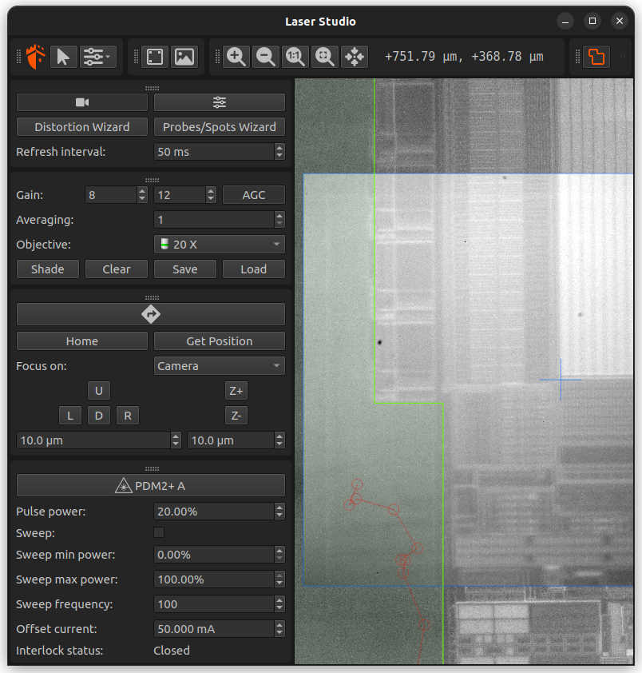

# Laser Studio

An open source python3 software designed to control hardware evaluation benches
to conduct automatized evaluations.

Laser Studio permits to have a visual representation of a spatial environment,
define zones of interests, and launch an automated scanning process to physically
and randomly go through these zones, by controlling motion devices.



## Installation

Laser Studio requires **Python 3.10, 3.11, or 3.12** (`requires-python` is `>=3.10,<3.13`).

Install from PyPI:

```shell
pip install laserstudio
```

From a clone of the repository (current directory is the project root):

```shell
git clone https://github.com/Ledger-Donjon/laserstudio.git
cd laserstudio
pip install .
```

For local development, an editable install is convenient:

```shell
pip install -e .
```

With [Poetry](https://python-poetry.org/):

```shell
poetry install
```

### Runtime dependencies

These packages are installed automatically with `laserstudio` (see `pyproject.toml` for exact version constraints):

| Package | Role |
| --- | --- |
| [PyQt6], [PyQt6-Charts] | GUI |
| [pystages] | Motion stages |
| [Pillow], [opencv-python] | Imaging |
| [PyYAML] | Configuration |
| [shapely], [triangle] | Geometry |
| [requests] | HTTP |
| [numpy], [scipy] | Numerics |
| [pypdm] | PDM protocol |
| [flask], [flask-restx] | REST API |
| [hidapi] | USB HID |
| [colorama] | Terminal colors |
| [hyshlr], pylmscontroller | Ledger hardware integration |

### Optional dependency groups

Extras are defined in `pyproject.toml` under `[project.optional-dependencies]`:

| Extra | Purpose | Install |
| --- | --- | --- |
| `test` | Unit tests ([pytest], [pytest-cov]) | `pip install laserstudio[test]` |
| `lint` | Static typing ([mypy] and stubs) | `pip install laserstudio[lint]` |
| `docs` | Building documentation ([Sphinx], RTD theme, MyST) | `pip install laserstudio[docs]` |

From a clone, combine extras, for example:

```shell
pip install -e ".[test,lint,docs]"
```

### NIT cameras (optional)

Support for New Imaging Technologies cameras uses **pynit**, which is **not** declared as a PyPI dependency (licensing / packaging constraints). Install it only if you need that hardware:

```shell
pip install git+https://github.com/Ledger-Donjon/pynit.git
```

(Your team may use SSH, a private package index, or an internal build instead.)

## Usage

To run Laser Studio, open a terminal and run Laser Studio with the following command:

```shell
laserstudio
```

## Documentation

Advanced documentation of Laser Studio is available on [Read The Docs].

## Licensing

LaserStudio is released under GNU Lesser General Public License version 3 (LGPLv3). See LICENSE and LICENSE.LESSER for license detail

[PyQt6]: https://pypi.org/project/PyQt6/
[PyQt6-Charts]: https://pypi.org/project/PyQt6-Charts/
[Pillow]: https://pillow.readthedocs.io/en/stable/index.html
[opencv-python]: https://github.com/opencv/opencv-python
[PyYAML]: https://pypi.org/project/PyYAML/
[pystages]: https://github.com/Ledger-Donjon/pystages
[hyshlr]: https://pypi.org/project/donjon-hyshlr/
[pylmscontroller]: https://pypi.org/project/pylmscontroller/
[shapely]: https://shapely.readthedocs.io/en/stable/manual.html
[triangle]: https://rufat.be/triangle/
[requests]: https://pypi.org/project/requests/
[numpy]: https://pypi.org/project/numpy/
[scipy]: https://pypi.org/project/scipy/
[pypdm]: https://pypi.org/project/pypdm
[flask]: https://pypi.org/project/flask
[flask-restx]: https://pypi.org/project/flask-restx
[hidapi]: https://pypi.org/project/hidapi
[colorama]: https://pypi.org/project/colorama/
[pytest]: https://pypi.org/project/pytest/
[pytest-cov]: https://pypi.org/project/pytest-cov/
[mypy]: https://pypi.org/project/mypy/
[Sphinx]: https://pypi.org/project/Sphinx/
[Read The Docs]: https://laserstudio.readthedocs.io/
