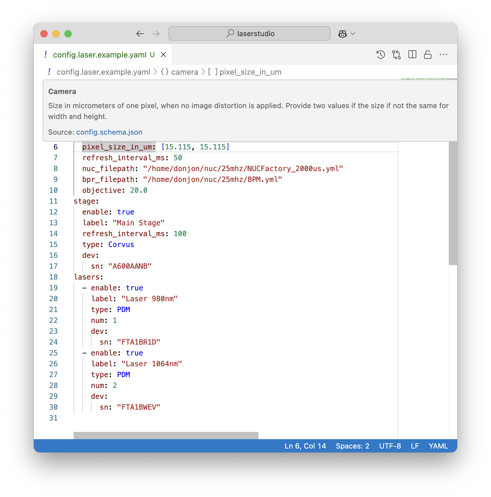

# Configuration File

A configuration file is a YAML structured file giving information about the structure of the hardware bench.

## File location

The file `config.yaml` is first retrieved from the working directory. If it is not found, the program will look to each parent directory until it reaches the Home directory. If the file is not found, the program will prompt the user to generate a new configuration file.

This permits to have a default configuration file for your bench, that you place at your Home directory, and specific configuration files for particular projects, placed in your project directory.

You can also specify the location of the configuration, by providing the path at startup of Laser Studio

```bash
laserstudio --conf_file /path/to/config.yaml
```

## File generation

If no suitable configuration file is found, the program will prompt the user to generate a new configuration file. The user will be asked to provide the information about **properties** of **instruments** composing the bench.

You can also generate a new configuration file by running the following command:

```bash
laserstudio_generate_config
```

## File structure

Here is an example of a configuration file:

```yaml
# yaml-language-server: $schema=https://raw.githubusercontent.com/Ledger-Donjon/laserstudio/main/config_schema/config.schema.json
camera:
  enable: true
  label: "NIT IR Camera"
  type: NIT
  pixel_size_in_um: [15.115, 15.115]
  refresh_interval_ms: 50
  nuc_filepath: "/home/donjon/laserstudio/nuc/25mhz/NUCFactory_2000us.yml"
  bpr_filepath: "/home/donjon/laserstudio/nuc/25mhz/BPM.yml"
  objective: 20.0
stage:
  enable: true
  label: "Main Stage"
  refresh_interval_ms: 100
  type: Corvus
  dev:
    sn: "A600AANB"
lasers:
  - enable: true
    label: "Laser 980nm"
    type: PDM
    num: 1
    dev:
      sn: "FTA1BR1D"
  - enable: true
    label: "Laser 1064nm"
    type: PDM
    num: 2
    dev:
      sn: "FTA1BWEV"
probes:
  - enable: true
    label: "Probe 1"
```

## Schema validation

The `yaml-language-server` directive at first line permits to use schema validation in your editor. Usage of schema is available [on JSON Schema](https://json-schema.org/).

In Visual Studio Code, you can use the following extension: `redhat.vscode-yaml` that uses the `yaml-language-server` to provide schema validation.

This extension permits to give you a visual feedback on the correctness of your configuration file, and also a description about the instruments and their properties.


